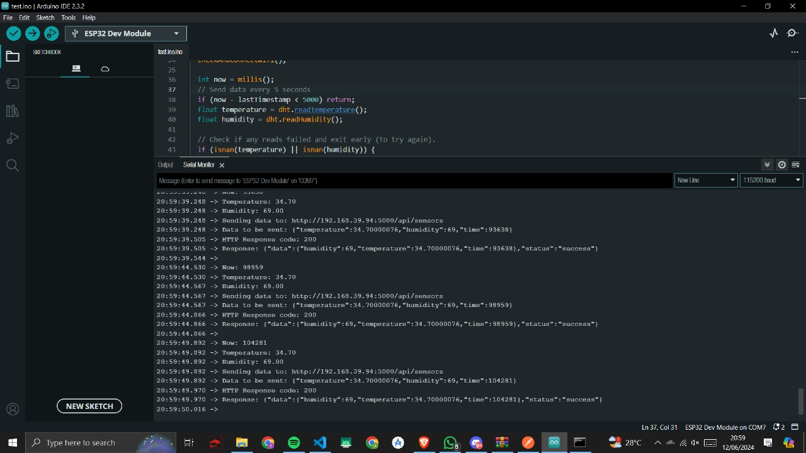
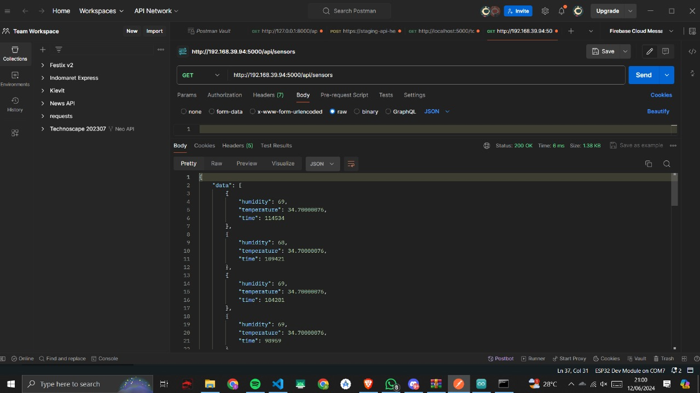
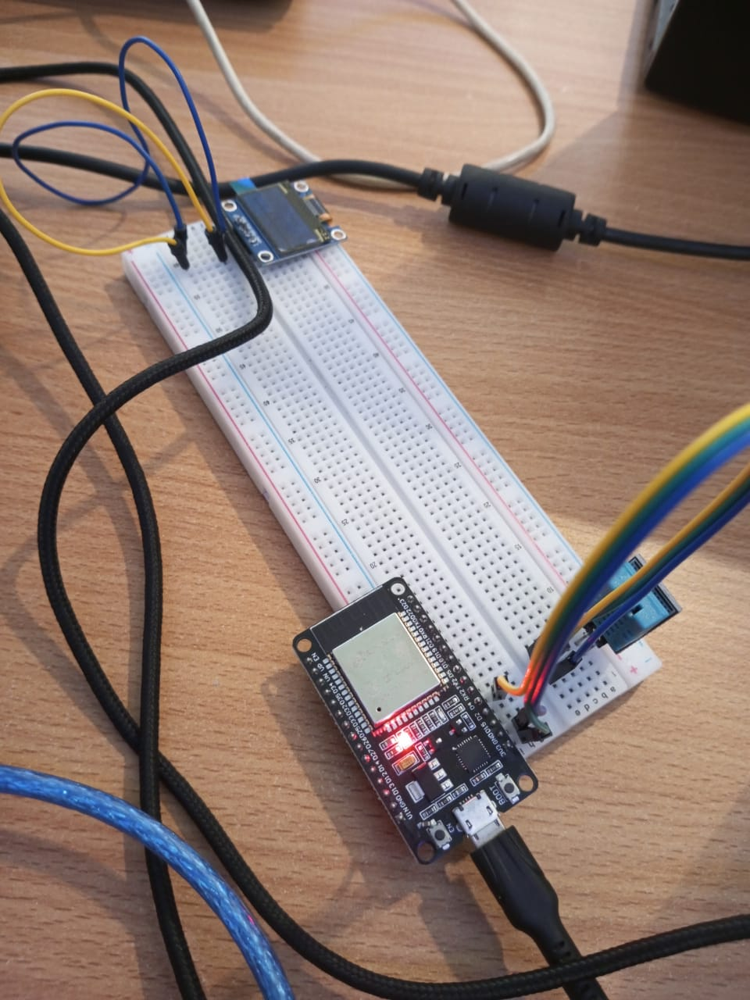

# Technical Assignment SIC

## Tentang Project
Project ini dibuat untuk submission technical assignment Samsung Innovation Campus.

## File dht.ino
File ini berisi kode untuk mendeteksi sensor DHT dan mengirimkan datanya ke server melalui HTTP Request POST ke endpoint `sensors`. Library yang digunakan adalah DHT, WiFi, ArduinoJson, dan WiFi.

## File app.py
File ini berisi kode untuk mendefinisikan route default dan route `sensors`. Route sensors memiliki dua method yaitu GET dan POST. Untuk datanya masih disimpan di dalam list bernama `dataList`. Ketika GET maka akan me-return `dataList`. Ketika POST maka akan menambahkan data yang dikirimkan ke index pertama `dataList`.

## Lampiran
Di sini terlihat bahwa data sensor berhasil terkirim ke server.

Lalu kita cek apakah datanya sudah masuk dengan GET Request endpoint `sensors` di Postman.

Ini adalah rangkaian fisik hardwarenya.

